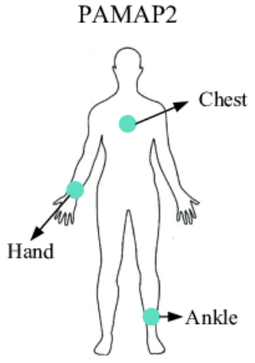

# Multivariate Time-Series Classification

In this project, we aim to explore the multivariate time series classification problem. To do so, we will use the article by Zheng et al (2014) as a baseline and then improve upon their architecture using ideas from various recent papers.

In their article, Zheng and al. use, among others, the PAMAP2 database; containing data from different sensors placed on the body of 9 people performing 18 different activities. The dataset is characterised by 54 features; a timestamp, an activity ID and data from 3 inertial measurement units, taken at a frequency of 100Hz. With such a multivariate time series associated with each activity, the goal is to identify the type of activity according to the sensor data.

## Baseline

Our baseline, as mentioned above, will be the 2-stage MC-DCNN architecture used by Zheng et al (2014). This approach was one of the first Deep Learning methods to be applied to Multivariate time series classification. The authors apply 2 layers of Convolutions, Activation and Pooling to each channel of the time series, each channel learning its own convolutions. The processed time series are then flattened, concatenated together and processed through a two layer fully connected layer before applying the softmax function to perform the final classification.

_Architecture.png)

## Improvement
To expand on this baseline we will be adding multi-scale convolutions for each channel. Adding multiple scales have been shown to add significant performance (Lian et al 2018, Sun et al 2020, Lim et al 2020) to time series forecasting. For each channel we will look at short, medium and long term time scales. An easy way to build the different time scales would be by taking a longer window of the time series and then downsampling so that all time scales are of the same length. Instead, we will feed them through more layers of convolutions in effect learning kernels that perform the downsampling. The short term will be processed through 1-2 layers, the medium will be processed through 2-4 and the longer will be processed through 3-6. We will then take all the multi-channel and multi-scale time series after all of the convolution layers and process them through an attention mechanism which will combine them into a final representation. The final representation will finally be fed into a fully connected layer before being passed through the softmax function for classification. 

## Bibliography

Lian, C., Zhang, J., Liu, M., Zong, X., Hung, S., Lin, W., & Shen, D. (2018). Multi-channel multi-scale fully convolutional network for 3D perivascular SPACES segmentation IN 7T MR images. Medical Image Analysis, 46, 106-117. doi:10.1016/j.media.2018.02.009

Lim, B., Arik, S. O., Loeff, N., & Pfister, T. (2019). Temporal fusion transformers for interpretable multi‐horizon time series forecasting. Preprint, arXiv:1912.09363.

Reiss. A., & Stricker. D., (2012). Creating and Benchmarking a New Dataset for Physical Activity Monitoring. The 5th Workshop on Affect and Behaviour Related Assistance (ABRA).

Sun, J., Zhang, J., Li, Q., Yi, X., Liang, Y., & Zheng, Y. (2020). Predicting citywide crowd flows in irregular regions using multi-view graph convolutional networks. IEEE Transactions on Knowledge and Data Engineering, 1-1. doi:10.1109/tkde.2020.3008774

Zheng, Y., Liu, Q., Chen, E., Ge, Y., & Zhao. J.L., (2014). Time series classification using multi-channels deep convolutional neural networks. International Conference on Web-Age Information Management, Springer, pp. 298-310.
